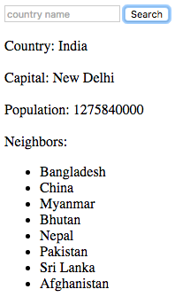
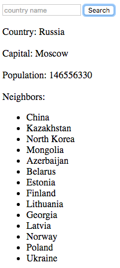

# Assessment 04
This coding exercise will require you to use AJAX, callbacks, and jQuery to make a simple country information application.

## Countries API
[This particular API does not require a key. Yay!](http://restcountries.eu/) You will need to use the `Country Code` API call and the `Country Name Full Text` API call.

### Button
You will have to attach an event listener to the button that sends out an AJAX request for information on a country. **Every time you click the button, the input text box should be cleared.**

### Callback One
The data from the AJAX call should be passed to a callback function that handles the country name, capital, population, and neighbors. **console log the data returned from the API call** Use jQuery to change the HTML of the `` elements. You will have to iterate through the neighbors array.

### Neighboring Countries
The objects returned from the API call should have a property `borders` that stores an array of three letter country codes. For example, the `borders` array for the United States would look like `["MEX", "CAN"]`. For each of the country codes in this `borders` array, you'll need to get the full name of the country. **iterate through the neighboring countries**

### Callback Two
You will need a second AJAX request that retrieves the actual name of a country given a country code. **console.log the data from each of these AJAX requests** The success callback should append a list item to the `<ul>` already present on the page.

### Test Cases
    

